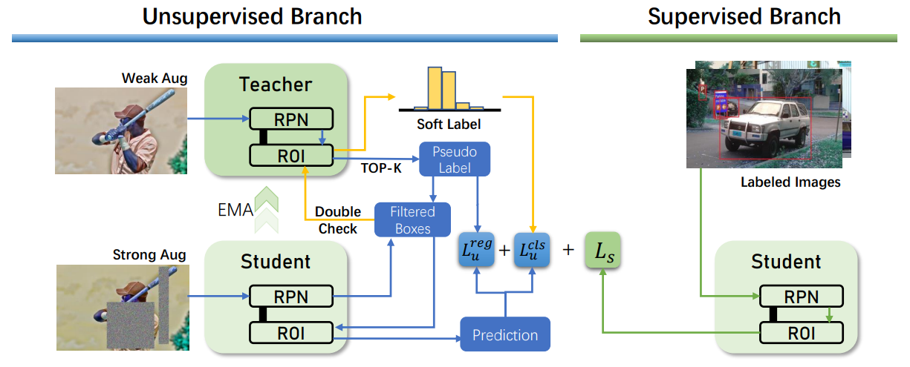

# Double-Check Soft Teacher for Semi-supervised Object Detection


Official implementation of IJCAI-2022 paper "Double-Check Soft Teacher for Semi-supervised Object Detection".


## Main Results

### Partial Labeled Data

The results are shown in the following:

#### 
| Method | 1% | 5% |10%|100%|
| ---- | -------| ----- |----|----|
| E2E Soft Teacher | 20.46 |30.74|34.04|44.5|
| Ours | 23.00 |32.20|35.50|44.6|

#### 
## Usage

### Requirements
- `Ubuntu 16.04`
- `Anaconda3` with `python=3`
- `Pytorch`
- `mmdetection`
- `mmcv`

#### Notes
- Our codes are modified from [E2E Soft Teacher](https://github.com/microsoft/SoftTeacher)
- The project is based on `mmdetection v2.16.0`, the corresponding package is uploaded in this project.
### Installation
```
make install
```

### Data Preparation
- Download the COCO dataset
- Execute the following command to generate data set splits:

```shell script
# YOUR_DATA should be a directory contains coco dataset.
# For eg.:
# YOUR_DATA/
#  coco/
#     train2017/
#     val2017/
#     unlabeled2017/
#     annotations/
ln -s ${YOUR_DATA} data
bash tools/dataset/prepare_coco_data.sh conduct
```

### Training
- To train model on the **partial labeled data** setting:
```shell script
# JOB_TYPE: 'baseline' or 'semi', decide which kind of job to run
# PERCENT_LABELED_DATA: 1, 5, 10. The ratio of labeled coco data in whole training dataset.
# GPU_NUM: number of gpus to run the job
for FOLD in 1 2 3 4 5;
do
  bash tools/dist_train_partially.sh <JOB_TYPE> ${FOLD} <PERCENT_LABELED_DATA> <GPU_NUM>
done
```
For example, we could run the following scripts to train our model on 10% labeled data with 4 GPUs:

```shell script
bash tools/dist_train_partially.sh semi ${FOLD} 10 4
# ${FOLD} can be 1 2 3 4 5
```

- To train model on the **full labeled data** setting:

```shell script
bash tools/dist_train.sh <CONFIG_FILE_PATH> <NUM_GPUS>
```
For example, to train ours `R50` model with 8 GPUs:
```shell script
bash tools/dist_train.sh configs/soft_teacher/DCST_faster_rcnn_r50_caffe_fpn_coco_full_720k.py 8
```
- To train model on **new dataset**:

The core idea is to convert a new dataset to coco format. Details about it can be found in the [adding new dataset](https://github.com/open-mmlab/mmdetection/blob/master/docs/tutorials/customize_dataset.md).


### Evaluation
```
bash tools/dist_test.sh <CONFIG_FILE_PATH> <CHECKPOINT_PATH> <NUM_GPUS> --eval bbox --cfg-options model.test_cfg.rcnn.score_thr=<THR>
```
### Inference
  To inference with trained model and visualize the detection results:

  ```shell script
  # [IMAGE_FILE_PATH]: the path of your image file in local file system
  # [CONFIG_FILE]: the path of a confile file
  # [CHECKPOINT_PATH]: the path of a trained model related to provided confilg file.
  # [OUTPUT_PATH]: the directory to save detection result
  python demo/image_demo.py [IMAGE_FILE_PATH] [CONFIG_FILE] [CHECKPOINT_PATH] --output [OUTPUT_PATH]
  ```
  For example:
  - Inference on single image with provided `R50` model:
   ```shell script
  python demo/image_demo.py /tmp/tmp.png configs/soft_teacher/soft_teacher_faster_rcnn_r50_caffe_fpn_coco_full_720k.py work_dirs/downloaded.model --output work_dirs/
   ```

  After the program completes, a image with the same name as input will be saved to `work_dirs`